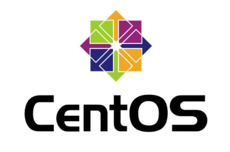
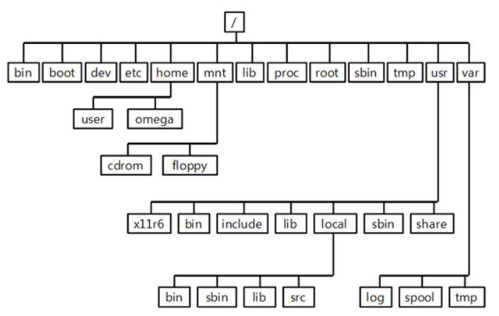
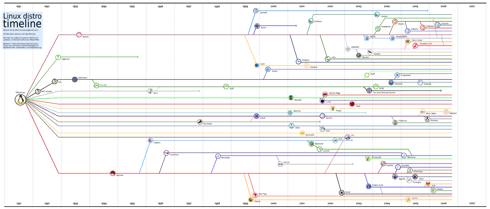

# CentOS Linux
CentOS를 기반으로 한 OS 기초
<hr />



### 리눅스의 특징
- 오픈소스 운영체제
    + 소스코드 및 모든 관련자료 공개, 공유
- 멀티유저(다중사용자) 운영체제
    + 다수의 사용자가 동시에 동일한 시스템에 접근 가능
- 멀티태스킹(다중작업) 운영체제
    + 여러 개의 테스크를 동시에 실행
    + 교대로 컴퓨터의 자원 사용 가능
    + 가상 터미널 환경
        * 하나의 모니터에 여러 개의 가상 화면으로 작업 가능
- 다중 스레드를 지원하는 네트워크 운영체제
    + 하나의 프로세스 내에서 다수의 네트워크 작업 동시처리
    + 네트워크 서버 사용 가능
    + 인터넷과 이더넷에 안정적으로 연결
    + 웹브라우저, 메일, 뉴스, 웹 서버 등의 모든 인터넷 서비스 기능 가능
- 여러 종류의 파일 시스템을 지원하는 운영체제
    + ext2, ext3, ext4, FAT, FAT3, NTFS, SMB, CIFS, NFS 등
<hr />

### 장점
- 유닉스와 완변학 호환
    + POSIX(Portable Operating System Interface) 규격 따름
- PC용 운영체제보다 안정적
    + 지속적인 운영에 안정적으로 작동
    + 네트워크 기반하의 멀티유저, 멀티태스킹 가능
        * 다수의 작업자가 동시에 사용해도 안정적인 시스템 운영 가능
- 하드웨어 기능 효과적 사용
    + OS 운영시 적은 RAM 사용량
    + SWAP 방식을 통해 메모리 효율성 높임
- 오픈 소스 운영체제
    + 사용자의 편의에 맞게 조율 가능

### 단점
- 공개 운영체제이기 때문에 문제점 발생 시 기술 지원 한계
    + 엔지니어를 통한 직접적인 기술 지원 불가
- 보안상의 취약점에 쉽게 노출
    + 공개 운영체제임으로 보안상 취약점 발생여지 존재
        * but 지속적인 업데이트로 높은 보안성 유지
<hr />

### 리눅스의 디렉터리
- 디렉터리란?
    + 파일 저장소를 의미
- 리눅스 디렉터리
    + 최상위 디렉터리(/)를 기준으로 하위 디렉터리 존재
    + 계층적 트리 구조로 구성
    
    + 디렉터리 간에는 부모와 자식 간의 관계 가짐
        * 상위 디렉터리(=부모 디렉터리)
        * 하위 디렉터리(=자식 디렉터리)
- 리눅스 기본 디렉터리 종류
    + `/`
        * 최상위 디렉터리(= 루트 디렉터리)
        * 모든 디렉터리의 출밤점
        * 다른 시스템과의 연결점
    + `/boot`
        * 부모 디렉터리
        * 커널 이미지와 부팅 정보 파일 저장
        * 가상 파일 시스템
        * 메모리 상에 저장
        * 사용자가 해당 디렉터리 접근시 커널에서 파일 내용을 동적으로 생성
    + `/proc`
        * 시스템 정보 디렉터리
        * 커널 기능 제어
        * 현재 실행되는 프로세스, 사용 장치, 하드웨어 정보 저장
    + `/lib`
        * 동적,정적 공유 라이브러리 디렉터리
            - 동적 라이브러리 - 매모리의 효율성 높음
        * 커널 모듈 파일
        * 프로그램 실행 지원 라이브러리
        * 디스크의 공간 절약
        * 
    + `/bin`
        * 기본 명령어 저장 디렉터리
        * ROOT 사용자, 일반 사용자가 공용으로 사용 가능한 명령어 디렉터리
    + `/dev`
        * 시스템 디바이스 파일 저장 디렉터리
    + `/etc`
        * 시스템 환경 설정 파일 저장 디렉터리
        * 부팅 관련 스크립트 파일 저장 디렉터리
        * 사용자 정보 및 암호 정보 파일, 보안 파일 저장
    + `/root`
        * 시스템 관리자용 홈 디렉토리
    + `/sbin`
        * 관리자용 시스템 표준 명령 저장
        * 시스템 관리와 관련된 실행 명령어 저장
    + `/usr`
        * 사용자 디렉터리
        * 사용자 데이터, 애플리케이션 저장
    + `/home`
        * 사용자 계정 디렉터리
        * 계정의 홈 디렉터리 위치
        * 일반 사용자가 접속시 처음 위치
    + `/var`
        * 가변 자료 저장 디렉터리
        * 로그파일, 메일 데이터 저장
    + `/tmp`
        * 임시 생성파일 저장
        * 모든 사용자가 읽기와 쓰기 허용
        * 스티키 비트(Sticky bit) 설정으로 파일의 소유자만 파일 삭제 가능
    + `/mnt`
        * 파일 시스템 일시적으로 마운트 할 때 사용
    + `/lost+found`
        * 결함 존재하는 파일에 대한 정보가 저장되는 디렉터리 
<hr />

### 리눅스 배포판
- 리눅스 전체 시스템을 구성하는 소프트웨어 패키지 형태
- 자유로운 소프트웨어로 구성된 운영체제
- 종류
    + 슬랙웨어 리눅스(Slackware Linux)
    + 데비안(Debain)
    + 우분투(ubuntu)
    + 레드햇
    + RHEL(Red Hat Enterprise Linux)
    + 페도라
    + CentOS
    + 수세(SuSe)
<hr />

### 리눅스 역사
- 리눅스의 역사


- 1960년대 후반
    + 1969년 켄 톰슨이 초기 형태의 UNIX 개발
- 1970년대
    + 1971년 데니스 리치가 c언어 개발
    + 어셈블리어로 개발된 UNIX를 C언어로 재작성
- 1980년대
    + 리차드 스톨먼 GNU 프로젝트 시작
    + GNU 선언문 발표
    + 1987년 앤드루 타넨바움이 교육용 유닉스 계열 운영체제 미닉스 개발
- 1990년대
    + 리누스 토발즈 GNU에 적합한 커널 개발
    + 유닉스 커널과 호환 가능한 커널인 리눅스를 GNU 시스템의 커널로 채택
<hr />

### 리눅스 라이선스
- GNU(GNU's Not UNIX)
- 자유 소프트웨어 재단(FSF, Free SoftWare Foundation)
- 오픈 소스 소프트웨어(Open Source Software)
- GNU GPL(General Public License)
- GNU LGPL(Lesser General Public License)
- BSD(Berkeley Software Distribution) 라이선스
- 아파치(Apache) 라이선스
- MIT(Massachusetts Institute of Technology) 라이선스
- MPL(Mozilla public Lincense)
<hr />

### 리눅스의 설치 개요
- Mininal
    + 리눅스 설치 시 필수 패키지만 설치
- 데스크탑
    + 개인용 컴퓨터에 적합한 패키지 설치
    + 모든 리눅스 파티션 삭제
    + 데스크탑 운영에 적합한 환경으로 설치 진행
    + 문서 작성, 멀티미디어, 그래픽 도구 관련 프로그램 등이 설치됨
- 서버 
    + 하드디스크의 모든 파티션을 삭제
    + 서버 운영에 적합한 패키지 설치
    + Basic 서버
        * 리눅스 서버의 필수 기본 패키지 설치
    + Database 서버
        * 데이터베이스 서버 관련 패키지 설치
    + Web 서버
        * 아파치 웹 서버 관련 패키지 설치
- 랩탑
    + 노트북 등 랩탑 시스템에 적합한 패키지 설치
- 가상 호스트
    + 가상화 시스템 운영을 위한 패키지 설치
    + 하이퍼바이저 KVM이 설치
    + Xen이 설치
- Software Development WorkStation
    + 소프트웨어 설치 시 필요한 다양한 도구(tool)이 포함되어 설치
    + 소스 컴파일 도국를 기본적으로 포함하기 위해 선택
- 사용자 설정 시스템
    + 사용자 취향에 맞는 소프투웨어 선택 후 설치
<hr />

### 파티션(Partition)의 특징
- 하나의 물리적 디스크를 여러 개의 논리적인 디스크로 분할하는 것
- 파티션마다 독립적인 파일 시스템이 운영되어 파일점검 시간이 줄어들어 부팅 시간을 단축
- 파티션간의 관계성이 독립적이므로 높은 안정성을 보장
- 백업과 업그레이드가 편리
- 파티션 상태 정보 확인 `/proc/partitions`
<hr />

### 파티션의 종류
- 주 파티션
    + 부팅 가능
    + 최대 4개의 주 파티션 분할 가능
    + 하나의 확장 파티션안에 여러 개의 논리 파티션을 분할하여 데이터 저장 가능
- 확장 파티션
    + 주 파티션 내에 생성
    + 파티션 번호는 `1 ~ 4`로 할당
    + 데이터 저장 영역이 아닌 논리 파티션 생성
- 논리 파티션
    + 확장 파티션 내에 생성
    + 12개 이상 생성하지 않도록 권고
    + 5개 이후로 번호 생성
- 스왑 파티션
    + 하드디스크의 일부를 메모리처럼 사용
    + 주 파티션 또는 논리 파티션에 생성
    + 부족한 메모리의 용량을 하드디스크로 대신하여 사용
    + 스왑 영역의 크기는 메모리의 2배로 권고
<hr />

### 디스크 표기
- 분할된 파티션은 디스크의 장치 파일명 뒤에 숫자로 표가
```
/dev/hd a 3
```
- hd의 위치
    + 디스크의 유형
    + sd 또는 hd 사용
- a의 위치
    + 한 케이블에 묶여진 하드디스크의 우선순위
    + a, b, c ...
- 3의 위치
    + 파티션 번호
    + 1 ~ 4
        * primary 또는 extended
    + 5 ~
        * logical 파티션
<hr />

### 파티션 마운트 지정 디바이스명
- 플로피 디스크 
    + `/dev/fd0`
    + `/dev/fd1`
- SCSI
    + `/dev/sda`
    + `/dev/sdb`
- CD-ROM
    + `/dev/scd0`
    + `/dev/sr0`
- IDE 디스크
    + `/dev/hda`
    + `/dev/hdb`
    + `/dev/hdc`
    + `/dev/hdd`
+ XT 디스크
    + `/dev/xda`
    + `/dev/sdv`
<hr />

### 파일 시스템
- 운영체제가 파일을 시스템의 디스크 파티션상에 구현하는 방식
- 파일 저장 규칙 방식 존재
- 파티션에 파일 시스템 생성을 거쳐야 사용 가능
- 고유의 파일 시스템 및 다양한 파일 시스템 지원
- 파일 시스템의 유형
    + 리눅스 전용 파일 시스템
        * `ext`
        * `ext2`
        * `ext3`
        * `ext4`
    + 저널링 파일 시스템
        * `JFS`
        * `XFS`
        * `ReiserFS`
    + 네트워크 파일 시스템
        * `SMB` 
        * `CIFS` 
        * `NFS`
    + 클러스터링 파일 시스템
        * `레드햇 GFS`
        * `SGI cXFS`
        * `IBM SANFS`
        * `EMC Highroad`
        * `Campaq CFS`
        * `veritas CFS`
        * `오라클  OCFS2`
    + 시스템 파일 시스템
        * `ISO9660`
        * `UDF`
    + 타운영체제 지원 파일 시스템
        * `FAT`
        * `1VFAT`
        * `FAT32`
        * `NTFS`
        * `HPFS`
        * `SysV`
<hr />

### LVM(Logical Volume Manager)
- 다수의 하드디스크를 합쳐서 사용
- 한 개의 파일 시스템 사용
- lot's of Small Size Disk >> Big Size Disk
- 대용량의별도의 저장 공간이 필요할 때 활용
- 파티션 크기의 유동성 확보

    + 물리 볼륨
        * 여러 개의 물리적 하드디스크
        * 물리 볼륨을 합쳐서 하나의 물리적 그룹으로 만드는 것
        * 볼륨 그룹을 나눠서 다수 개의 논리 그룹으로 나눔
<hr />

### RAID
- 복수 배열 독립 디스크(REdundant Array of Independent Disks)
- 다수의 물리적 디스크를 하나의 논리적 디스크로 인식하는 기술
- 중복된 데이터를 여러 개의 하드디스크에 나눠서 저장
- RAID의 종류
    + 하드웨어 RAID
        * 하드웨어 자체를 여러개로 만들어서 공급
        * 안정된 시스템일수록 고가
    + 소프트웨어 RAID
        * 운영체제에서 지원
        * 저렴한 비용으로 안전한 데이터 저장 가능
- 레벨
    + 데이터를 저장하는 다양한 방법
    + 장치의 신뢰성, 성능 향상 등을 표기

- `RAID 0`
    + 스트라이핑 저장 방식
        * 연속된 데이터를 다수의 디스크에 나눠서 저장
    + 최소 2개의 하드디스크 필요
    + 입출력 작업이 모든 디스크에 동시 진행
        * 속도는 빠르지만, 하나의 디스크 고장시 전체 시스템 마비
    + 고장 대비 능력 없음
- `RAID 1`
    + 미러링 방식
        * 하나의 디스크에 데이터 저장시 동일 내용을 다른 디스크에 백업
        * 데이터 저장 시 두 배의 용량 필요
        * 결합허용 >> 성능저하
        * 주요 데이터 저장 가능
- `RAID 2`
    + 스트라이핑 저장 방식
        * 연속된 데이터를 다수의 디스크에 나눠서 저장
    + 기록용 디스크와 복구용 디스크 별도 제공
        * 해밍 코드 사용
    + 디스크 사용 효율성 낮음
        * 모든 SCSI 디스크에 ECC(에러 검출 기능)을 탑재
- `RAID 3`
    + 스트라이핑 저장 방식
        * 연속된 데이터를 다수의 디스크에 나눠서 저장
    + 패리티 방식
    + 최소 3개 이상의 하드디스크 필요
    + 데이터 복구
        * 패리티 저장 디스크에 기록된 정보를 XOR연산으로 확인
    + 대형 레코드를 사용하는 단일 사용자에게 적합
    + Byte 단위로 데이터 저장
- `RAID 4`
    + `RAID 3`와 유사한 방식
        * 2개 이상의 대이터 디스크의 전용 패리티 디스크 사용
    + Block 단위로 데이터 저장
- `RAID 5`
    + 스트라이핑 저장 방식
        * 연속된 데이터를 다수의 디스크에 나눠서 저장
    + 디스크마다 패리티 정보 가짐
        * 패리티 디스크이 병목현상을 줄임
    + 디스크 섹터 단위로 저장
    + 쓰기 작업이 적은 다중 사용자 시스템에 적합
- `RAID 6`
    + `RAID 5`의 확장판
    + dual parity
        * 더 좋은 무정지성 확보
    + 최소 4개의 드라이브 필요
<hr />

### 파티션 분할
- `fdisk`
    + 파티션 테이블을 관리하는 명령어
    + 생성, 수정, 삭제 가능
- 명령어
    + `a`
        * 부팅 파티션 지정
    + `ㅣ`
        * 파티션 목록 확인
    + `n`
        * 새로운 파티션 추가
    + `t`
        * 파티션 종류 변경
    + `w`
        * 파티션 정보 저장
    + `p`
        * 파티션 정보 확인
    + `q`
        * 작업 종료
<hr />

### 부트 매니저(Boot Manager)
- 부팅 과정
```
전원 ON -> ROM_BIOS 실행 -> 부트로더 실행 -> 스와퍼 프로세스 수행 -> init 프로세스 실행
-> 부팅 레벨 결정 -> rc.sysinit 스크립트 실행 -> rcX.d 스크립트 실행 -> X 윈도우 실행
```
<hr />

### 부트로더(bootloader)
- 기능 
    + 부트스트랩 로더(bootstrap loader)의 줄임말
    + 사용자가 컴퓨터를 이용할 수 있도록 디스크나 플래시에 저장된 운영체제를 읽어 주기억장치에 적재하는 프로그램
    + 운영체제를 올바르게 시행하기 위해 준비되는 모든 과정 담당
    + 임베디드 시스템(Embedded system) 부트로더
        * 시스템이 부팅할 때 가장 먼저 수행
    + 환경설정 및 운영체제 이미지를 메모리에 복사
    + = 부트매니저
    + 크기 512바이트
    + MBR(Master Boot Record)에 위치
    + 주 파티션마다 부트 섹터(Boot Sector) 할당
        * 하드디스크, 플로피 디스크, 기억 장치의 섹터
    + 분할된 주 파티션들은 자신의 부트 레코드를 MBR에 기록하여 실행
    + 다수의 운영체제가 설치된 경우 작업 운영체제를 선택할 수 있음
    + LILO(LInux LOader)
        * 리눅스 운영체제 한정되어 사용
        * System 전원이 공급되면 ROM-BIOS에서 시스템 제어권을 가지고 장착된 하드웨어를 검사
        * ROM-BIOS MBR(Master Boot RECORD)에 있는 Boot Loader에게 제어권 넘김
    + GRUB(Grand Unified Bootloader)
        * Erich Stefan Boleny에 의해 개발된 부트로더
        * LILO의 단점 극복
        * 리눅스 운영체제 외에도 다른 운영체제에서 사용 가능
        * LILO에 비해 설정 및 사용 편리
        * 부팅 정보 변경 용이
        * 다른 운영체제와 멀티부팅 가능
        * 커널의 경로 및 파일 이름으로 부팅 가능한 대화형 설정
        * 메뉴 인터페이스 환경 지원
        * 대화명 모드로 부트 정보 설정
        * 커널 위치와 커널 이미지 파일명만 알고 있으면 부팅 가능
        * 환경 설정 파일 `/boot/grub/grub.conf` or `/etc/grub.conf`
        * ROM-BIOS에서 사용하는 정보 사용
        * IDE, SCSI 장치명 별도 구분하지 않음
        * 장착 순서대로 0부터 시작하여 오름차순 표기
        * (디스크장치명,파티션명) 형식 표기
- 런레벨(run level)
    + 런레벨에 따라 작동하는 서비스 조정 가능
    + 부팅 마지막 단계에서 모든 프로세의 부모 프로세스인 init 생성
    + init이 수행해야 할 일련의 처리 방법
    + 0 ~ 6 까지 존재
    + /etc/rc.d/init.d 
        * 시스템 서비스의 시작과 중지를 시킬 수 있는 스크립트 포함
    + r
        * 실행 레벨에 따라 지정한 서비스를 실행하는 스크립트
    + rc.local
        * rc.sysinit에 의해 호출되는 파일
    + rc.sysinit
        * 부팅 시에 init에 의해 실행되는 스크립트
        * 시스템을 초기화하는 쉘 스크립트
    + rc0.d ~ rc6.d 
        * 각 실행 레벨 관련 디렉터리
        * 초기화 스크립트에 대한 심볼릭 링크 생성
    + `0`
        * 시스템 종료
    + `1`
        * 단일 사용자 모드(ROOT만)
    + `2`
        * 네트워크가 없는 다중 사용자 모드
    + `3`
        * 텍스트 모드(CUI)에 의한 다중 사용자 모드
    + `4`
        * 미사용
    + `5`
        * 그래픽 모드(GUI)에 의한 다중 사용자 모드
    + `6`
        * 시스템 재시작(재부팅), 명령어 reboot 또는 init 6과 동일
<hr />     

### 로그인과 로그아웃
- 입력한 패스워드와 `/etc/passwd` 필드 비교
- 쉘 설정 파일 실행
    + 검색 경로 설정
    + 터미널 종류 설정 및 다양한 터미널 설정
    + 환경변수 설정
    + 로그인 시 실행 명령어 실행
    - 로그인 메시지 출력
- 로그인 쉘 실행
    + `/etc/passwd`의 마지막 필드에 정의
    + 로그인 쉘에 따라 프롬프트 다름
        * sh   `/bin/sh`   $
        * csh   `/bin/csh`   %
        * ksh   `/bin/ksh`   $
        * bash   `bin/bash`   $
- 로그아웃
    + logout
    + exit
    + `ctrl + D`
    + 일정시간 작업하지 않는 사용자를 관리자는 강제 로그아웃 시킬 수 있음
<hr />

### 사용자 생성 및 계정 관리 명령어
- `which 명령어`
    + 명령어의 경로 확인
    + 명령어의 위치 찾기
    + 현재 위치에서 명령어를 실행할 경우 어떤 명령이 실행되는지 확인
- `alias 별명='명령어'`
    + 자주 사용하는 명령어를 특정 문자로 사용하게 만듬
- `unalias 옵셥 별명`
    + alias로 설정한 명령 해제
    + `-a` 모든 명령 해제
- `PATH`
    + 실행 파일들의 디렉터리 위치를 저장해 놓은 환경 변수
    + 특정 명령어를 입력하면 PATH 변수에 저장되어 있는 경로에서 해당 명령어를 찾아 실행
    + `echo $PATH`
        * 지정된 PATH 값 확인
    + `export 변수명=$변수명:변수값`
        * 기존의 PATH에 새로운 경로 추가    
- `man 섹션 옵션 명령어`
    + 옵션
        * `-a, -h, -f, -k, -w`
    + 섹션
        * `1 ~ 9`
- `info 명령어`
    + 리눅스 명령어의 사용 방법, 옵션 확인
    + 명령어 한정적
- `whatis 명령어`
    + 명령어에 대한 기능을 간략히 표사
- `manpath 명령어`
    + man 페이지의 위치 경로를 검색하여 표시해 주는 명령어
- `whereis 옵션 명령어`
    + 명령어의 절대 경로 소스코드 설정 파일 등의 위치 및 정보 출력
- `apropos 문자열`
    + `man` 에지 설명에서 지정한 키워드를 포함하고 있는 명령어
- `useradd 옵션 계정명`
    + 옵션
        * `-s, -d, -f, -e, -c, -G`
    + `adduser`와 동일한 기능
    + `/etc/passwd`, `/etc/shadow`, `/etc/group`에 저장
- `passwd 옵션 계정명`
    + 옵션 
        * `-S, -d, -l, -u`
    + 생성된 계정의 비밀번호 변경 명령어
- `su 옵션 사용자 셀변수`
    + 옵션
        * `-, -l, --login, -s, -c`
    + switch user
    + 현재 사용자를 로그인하지 않으면서 다른 사용자 계정으로 로그인
- `파일명 /etc/default/useradd`
    + 옵션
        * `-g, -b, -f, -e, -s`
    + 사용자 계정을 추가할 때 사용되는 정보를 읽어오는 파일
- `파일명 /etc/passwd`
    + 계정의 정보를 가지고 있는 파일
    + 파일 내용은 여러 개의 필드로 구성
- `파일 /etc/shadow`
    + 계정의 패스워드 정보가 암호화되어 있는 파일
    + 암호화 패스워드 및 계정의 유효 기간 등을 기록
- `파일 /etc/login.defs`
    + 사용자 계정 설정과 관련된 기본값을 정의한 파일
    + 새로운 계정을 생성할 때 참조
- `usermod 옵션 계정명`
    + 옵션
        * `-u uid, -g, -G, -d 홈 디렉터리, -s 셀, -c 주석, -l ID`
    + /home에 위치한 사용자들의 정보를 변경
- `userdel 옵션 계정명`
    + 옵션
        * `-r`
    + 기존 계정 정보를 삭제
- `change 옵션 계정명`
    + 옵션
        * `-l, im, -M, -E, -W`
    + 패스워드의 만료 정보를 변경
- `파일명 /etc/group`
    + 사용자 그룹에 대해 정의되어 있는 파일
    + 파일 수정, 변경 가능
- `파일명 /etc/gshadow`
    + 그룹의 암호를 MD5로 하여 저장
    + 그룹의 소유주, 구성원 설정 가능
- `groupadd 옵션 그룹명`
    + 옵션
        * `-g gid, -r`
    + 새로운 그룹을 생성
- `groupdel 그룹명`
    + 기존의 그룹을 삭제
    + 그룹안에 소속되어 있는 계정이 있을 경우 삭제 불가
- `groupmod 옵션 그룹명`
    + 옵션
        * `-g gid, -n 그룹명`
    + 그룹의 설정을 변경하는 명령어
- `users 옵션`
    + 옵션
        * `--version`
    + 시스템에 로그인한 사용자 정보 출력
- `who 명령어`
    + 옵션
        * `-b, -q, -r`
    + 현재 시스템에 접속해 있는 사용자 조회
    + 계정명, 터미널 정보, 접속 시간, 접속한 서버 확인
    + 관리자, 일반 계정 모두 사용 가능
    + `whoami`는 자신의 정보 조회
- `w`
    + 현재 접속 중인 사용자들의 정보 출력
- `id 옵션 계정명`
    + 옵셥
        * `-g, -G, -u`
    + 사용자 계정의 `uid`, `gid`, `group`을 확인
- `groups 계정명`
    + 사용자 계정이 속한 그룹 목록을 확인하는 명령어
<hr />

### 디렉터리 및 파일
- `pwd`
    + 현재 작업 중인 디렉터리의 위치 확인
- `cd 상대경로 or 절대경로 설정경로`
    + 디렉터리를 이동할 때 사용하는 명령어
    + 상대경로
        * 현재 작업 중인 디렉터리가 기준
    + 절대경로
        * `/`에서 시작되는 경로가 기준
- `mkdir 옵션 디렉터리명`
    + 옵션
        * `-m, -p, -v`
    + 새로운 디렉터리 생성
- `rmdir 디렉터리명`
    + 디렉터리만 삭제하는 명령어
    + 디렉터리안에 파일 존재할 경우 삭제 불가능
- `ls 옵션 경로명`
    + 옵션
        * `-a, -l, -d, -r, -R`
    + 현재 위치의 디렉터리 안에 존재하는 파일 목록 확인
- `cp 옵션 원본 파일명`
    + 옵션
        * `-b, -f, -i, -r`
    + 파일 또는 디렉터리릅 복사
- `mkdir 옵션 디렉터리명`
    + 옵션
        * `-m, -p, -v`
    + 새로운 디렉터리 생성
- `rmdir 디렉터리명`
    + 디렉터리만 삭제
    + 디렉터리 안에 파일이 존재하는 경우 삭제 불가
- `ls 옵션 경로명`
    + 옵션
        * `-a, -l, -d, -r, -R`
    + 파일 목록을 출력
- `cp 옵션 원본 파일명`
    + 옵션
        * `-b, -f, -i, -r`
    + 파일 또는 디렉터리를 복사
- `rm 옵션 파일명 or 디렉터리명`
    + 옵션
        * `-f, -i, -r`
    + 파일 또는 디렉터리를 삭제
- `mv 옵션 원본 대상`
    + 옵션
        * `-b, -f, -v`
    + 파일 또는 디렉터리를 이동하거나 파일명을 변경할 때 사용하는 명령어
- `touch 옵션 파일명`
    + 옵션
        * `-a, -m, -c, -t 시간정보, -r 파일1 파일2`
    + 파일 크기가 0바이트인 빈 파일 생성
    + 타임스탬프 변경
- `file 옵션 파일명`
    + 옵션
        * `-b, -f, -z, -i`
    + 파일의 종류 및 파일 속성값을 출력
- `find 경로 옵션 정규표현식 파일명`
    + 옵션
        * `-name, -user, -perm, -type, -atime n, -exec`
    + 현재 디렉터리에서부터 하위 디렉터리까지 주어진 조건의 파일을 찾아 해당 경로를 표시
- `locate 파일명`
    + 파일의 위치를 찾는 명령어
- `cat 옵션 파일`
    + 옵션
        * `-n, -b, -s, -A`]
    + 파일의 내용을 출력
- `head 옵션 파일명`
    + 옵션
        * `-c 숫자, -n 숫자, -숫자`
    + 파일의 앞부분을 지정한 만큼 출력
- `tail 옵션 파일명`
    + 옵션
        * `-c 숫자, -n 숫자, -숫자, -f, -v, -q`
    + 파일의 마지막 부분부터 지정행까지 출력
- `more 옵션 파일명`
    + 옵션
        * `-숫자`
    + 파일을 화면 단위로 끊어서 출력
- `less 파일명`
    + 텍스트 파일을 한 번에 한 화면씩 출력
- `grep 옵션 문자열 파일명`
    + 옵션
        * `-r, -E, -i, -v, -n, -l`
    + 파일에서 특정한 패턴(문자열) 또는 정규 표현식 찾기
- `wc 옵션 파일명`
    + 옵션
        * `-l, -w, -c`
    + 파일의 라인 수, 단어 수, 알파벳 수 출력
- `sort 옵션 정렬할 파일명`
    + 옵션 
        * `-b, -o, -r, -f, -f, -u, -m, -n`
    + 명령어 결과나 문서 내용을 정렬
- `cut 옵션 파일명`
    + 옵션
        * `-c, -f, -d, -s`
    + 파일에서 특정 필드 추출
    + 구분자로 필드 구분
- `split 옵션 파일명`
    + 옵션
        * `-b, -l`
    + 하나의 파일을 여러 개의 작은 파일로 분리
- `diff 옵션 파일명1 파일명2 or diff 옵션 폴더명1 폴더명2`
    + 옵션
        * `-b, -i, -s, -r`
    + 두 개의 파일을 행 단위로 비교하여 다른 부분을 출력
    + 두 개의 파일명을 매개변수로 사용하여 화면에 차이점 나열
- `cmp 옵션 파일명1 파일명2`
    + 옵션
        * `-b, -l, -s`
    + 두 개의 파일을 바이트(문자) 단위로 비교하여 출력
- `comm 옵션 파일1 파일2`
    + 옵션
        * `-1, -2, -3`
    + 두 개의 파일을 줄 단위로 비교하여 출력
- 리다이렉션(redirection)
    + 표준 입력과 표준 출력의 방향을 재지정
    + 표준 입력/출력/에러 화면 출력 -> 파일
    + 연산자
        * `>, >>, <, >&, <&`
- 파이프(Pipe)
    + `명령어1 | 명령어2 | 명령어3`
    + 둘 이상의 명령을 함께 묶어 출력 결과를 다른 프로그램이 입력으로 전환하는 기능
    + `명령어1 입력 -> 실행 단계 -> 명령어2 입력 => 실행 결과`
- 정규 표현식
    + `^`
        * 라인의 첫 글자
    + `$`
        * 라인의 끝 글자
    + `.`
        * 한 글자
    + `*`
        * `*` 기호 바로 이전의 글자나 정규 표현식이 0회 이상 반복
    + `[]`
        * 대체 글자 목록을 `[]`에 나열
        * `-`로 문자의 범위 지정
    + `[^]`
        * 대체 못할 글자 목록을 `[^]`에 나열
        * `-`로 문자의 범위 지정
    + `+`
        * `+` 기호 바로 이전 글자나 정규 표현식이 1회 이상 반복
    + `?`
        * `?` 기호 바로 이전 글자나 정규 표현식이 없거나 1회만 존재
    + `()`
        * 부분 정규 표현식의 시작과 끝을 표사
    + `|`
        * `|`로 구분된 단어들 중 최소 하나 존재
    + `{m, n}`
        * `{}` 기호 바로 이전 글자나 정규 표현식이 m개 이상 n개 이하 반복
<hr />

### 기타 명령어
- `ping 옵션 도메인명 or IP주소`
    + 옵션
        * `-c 요청 수, -i 초, -s 패킷 크기`
    + 외부 호스트에서 신호를 보내며 신호를 받은 호스트는 응답을 주면서 서로 네트워크가 연결되어 있는지 확인
- `traceroute 도메인명 or IP주소`
    + 목적지 호스트까지의 경로 표시
    + 구간의 정보를 기록
    + 목적지 호스트까지의 패킷 전송 지역 측정
    + 목적지 호스트로 향하는 경로상에 어떤 장애가 있는 경우 위치 파악 가능
- `nslookup 옵션 호스트명`
    + 옵션 
        * `-type=레코드`
    + 도메인명으로 IP 주소 조회
    + IP 주소로 도메인명 조회
    + 레코드 종류
        *`NS, MX, A, CNAME, SOA, PRT`
- `dig 서버명 호스트명 질의타입`
    + 질의타입 종류
        * `a, any, mx, ns, soa`
    + 호스트명에 대한 IP주소 정보 조회
    + IP 주소에 대한 호스트명 조회
- `host 옵션 도메인 or IP주소 DNS서버`
    + 옵션
        * `-d, -l zone, -r -t type`
    + 호스트명으로 IP주소 조회
    + IP주소로 호스트명 조회
- `hostname 옵션 파일명`
    + 옵션 
        * `-a, -d, -F, -v`
    + 시스템 이름 확인 또는 변경
- `shutdown 옵션 시간 경고메시지`
    + 옵션
        * `-r, -h, -c, -k, -f, -n, -t sec`
    + 시스템을 종료하거나 재부팅
    + 현재 수행 중인 프로세스를 종료
    + ROOT 사용자만이 권한을 가짐
- `init 런레벨`
    + 런레벨 종류
        * `0, 1, 2, 3, 4, 5, 6`
    + shudown 명령와 동일한 기능
- `reboot 옵션`
    + 옵션 
        * `-f`
    + 시스템을 재부팅
- `halt 옵션`
    + 옵션
        * `-f`
    + 시스템을 종료
- `cal 옵션 month year`
    + 옵션
        * `-i, -y`
    + 시스템에 설정된 달력을 출력
    + 현재 시스템 날짜로 기록된 month를 출력
- `data 옵션 MMDDhhmmCCYY.SS or 옵션 포맷`
    + dhqtus
        * `-s, -y`
- `clear`
    + 터미널의 내용을 지우는 명령어
- `tty`
    + 현재 사용하고 있는 단말기 장치의 경로명과 파일명 나타냄
    + 동일 계정으로 다중 접속한 경우 확인 유용
- `time`
    + 프로그램이 수행되는데 걸리는 시간 측정
    + 간단한 성능 체크에 유용
-  `wall 메세지 내용`
    + 모든 로그인된 사용자들에게 터미널을 통해 메시지를 전달
- `write 계정자명 ttyname`
    + 해당 사용자에게 메시지를 전달
- `mesg y or n`
    + write를 사용해서 들어오는 메시지 수신 여부를 확인하고 제어
<hr />

### 권한 및 그룹 설정
- 리눅스 시스템의 모든 파일과 디렉터리에는 접근권한(permission)과 소유권(ownership)이 부여됨
- `ls -l`
    + 파일 속성을 나타냄
<hr />

### 소유권(Ownership)과 관련 명령어
- `chown 옵션 소유자 파일명`
    + 파일과 디렉터리의 사용자 소유권과 그룹 소유권을 변경
- `chgrp 옵션 그룹명 파일명`
    + `change group`을 줄인 명령어
    + 파일이나 디렉터리의 그룹 소유권을 변경
    + 그룹 소유권만 변경 가능
<hr />

### 허가권(permission)과 관련된 명령어
- `ls -l`
    + 파일 유형과 허가권 확인
    + 파일 유형
        * 일반 파일, 디렉터리 파일, 특수 파일
    + 파일 권한
        * `읽기(read), 쓰기(write), 실행(execute)`
- `umask옵션값`
    + 새로 생성되는 파일이나 디렉터리의 기본 허가권 값을 지정
    + 파일의 기본 권한 
        * `666`
    + 디렉터리의 기본 권한
        * `777`
<hr />

### 특수 권한
- `SetUID`와 `SetGID`
    + 프로세스가 실행되는 동안 해당 프로세스의 root권한을 임시로 가져오는 기능
    + 높은 수준의 접근 요구 
    + 파일 접근 제한 해결
    + `SetUID`
        * 사용자가 사용할 때만 소유자 권한으로 파일 실행
        * 프로그램을 실행하는 동안 프로세스는 파일의 소유자와 같은 권한으로 실행
        * 파일의 소유자와 같은 권한으로 실행
    + `SetGID`
        * 사용자가 사용할 때만 그룹 권한으로 파일 실행
        * 파일의 그룹과 같은 권한으로 실행
        * 하위 디렉터리 또는 파일도 `SetGID`와 같은 권한 
- `Sticky bit`
    + 공용 디렉터리를 사용할 때 설정
    + 해당 파일의 소유자나 root만이 변경 가능
<hr />

### 디스크 쿼터(Disk Quota)
- 옵션
    + `quota`
        * 사용자 할당량 사용
    + `gquota`
        * 그룹 할당량 사용
    + `usrquota`
        * 사용자 할당량 사용
    + `grpquota`
        * 그룹 할당량 사용
    + `usriquota=파일명`
        * 저널 사용자 할당량 사용
    + `gripjquota=파일명`
        * 저널 그룹 할당량 사용
    + `jqfmt=format`
        * `usrjquota or grpjquota`가 지정될 때 사용된 할당량의 형식        
- 파일 시스템마다 사용자나 그룹이 생성할 수 있는 파일의 용량 및 개수를 제한
- 블록 단위의 용량 제한과 inode의 개수를 제한
- 사용자별, 파일 시스템별로 동작
- 그룹 단위로 용량 제한 가능
- 명령 순서
    1) `파일 /etc/fstab`에 디스크 쿼터 관련 설정
    2) 재마운팅(remounting) 실행 후 확인
    3) 마운트 된 쿼터를 끄고 생성된 쿼터 파일 삭제
    4) 쿼터 데이터베이스 생성
    5) 사용자별 쿼터 지정
    6) 쿼터 현재 상황 점검
- `quotaoff`
    + 옵션
        * `-a, -u, -g, -v`
    + 명령어 `quotaoff` 쿼터 서비스를 비활성화
- `quotacheck`
    + 옵션
        * `-a, -u, -g, -m, -n, -p, -v`
    + 파일 시스템의 디스크 사용 상태를 검색
- `edquota 옵션 계정명 또는 그룹명`
    + 옵션
        * `-u, -g, -f, -p`
    + 편집기를 이용해서 사용자나 그룹에 디스크 사용량을 할당하는 명령어
- `setquota 옵션 계정명 또는 그룹명 ~`
    + 옵션
        * `-u, -g, -a, -t`
    + 편집기가 기반이 아닌 명령행에서 직접 사용자나 그룹에 디스크 사용량을 할당하는 명령어
<hr />

### 파일 시스템의 개요와 종류
- 운영체제가 파일을 시스템의 디스크상에 구성하는 방식
- 파일 도는 자료를 쉽게 발견 및 접근할 수 있도록 보관, 조직하는 체제
- CD-ROM 같은 물리적 저장소 관리
- 리눅스 파일 시스템의 구조
    + `Super Block`
        * 해당 파일 시스템 관련 정보 저장
    + `Group Descriptor Table`
        * 각 Block Group을 관리하는 정보 저장
    + `Block bitmap`
        * 그룹 내에 있는 각 블록의 사용 상태를 나타냄
    + `inode`
        * 파일에 대한 제어 정보 및 데이터 블록 포인터 저장
        * 파일의 이름을 제외한 해당 파일의 모든 정보를 저장
- 리눅스 전용 디스크 기반 파일 시스템
    + `ext, ext2, ext3, ext4`
- 저널링 파일 시스템
    + 시스템의 비정상적인 종료 시 저널(로그)을 이용해 빠르면서도 안정적인 복구 가능
    + 데이터를 디스크에 쓰기 전에 로그에 데이터를 남겨 시스템의 비정상적인 셧다운에도 로그를 사용해 빠르고 안정적인 복구 기능을 제공하는 기술
    + 적용 파일 시스템
        * `JFS, xfs, ReiserFS`
    + 네트워크 파일 시스템
        * ``
- 기타 지원 가능한 파일 시스템
    + `FAT, VFAT, FAT32, NTFS, ISO9660, UDF, HPFS`
- `mount 옵션 디바이스명 디렉터리명`
    + 옵션
        * `-a, -n, -f, -o`
- `unmount 옵션 디바이스명 디렉터리명`
    + 옵션
        * `-a, -n, -f`
    + 특정 디바이스를 특정 디렉터리처럼 사용하기 위해 장치와 디렉터리를 연결
    + 부팅 후에 수동으로 마운트해서 사용, 끝나고 언마운트
- `eject 옵션 디바이스명`
    + 옵션
        * `-r, -f`
    + 이동식 보조기억장치같은 미디어를 해제하고 장치를 제거하는 명령어
- `fdisk 옵션 장치명`
    + 옵션
        * `-v, -f, -s`
    + 새로운 파티션 생성, 기존 파티션 삭제, 타입 결정 등을 수행
- `mkfs 옵션 장치이름`
    + 옵션
        * `-V, -f 파일시스템, -c, -l 파일명, -v`
    + 리눅스 파일 시스템 생성
    + fdisk로 파티션 분활 후 파일 시스템 생성
- `mke2fs 옵션 장치명`
    + 옵션
        * `-f, -b, -f, -i, -j, -R`
    + `ext2, ext3, ext4` 타입의 리눅스 파일 시스템 생성
- `fsck 옵션 장치명`
    + 옵션 
        * `-A, -a, -r, -s, -t 파일시스템`
    + 파일 시스템의 무결성을 점검하고 대화식으로 복구
- `e2fsck 옵션 디바이스명`
    + 옵션
        * `-p, -n, -y, -c, -f`
    + `ext2, ext3, ext4` 타입의 리눅스 파일 시스템을 점검 및 복구
- `du 옵션 파일 및 디렉터리명`
    + 옵션 
        * `-h, -a, -m, -k, -s, -c`
    + `Disk Usage`의 약자
    + 디렉터리별로 디스크 사용량을 확인
- `df 옵션 파일명`
    + 옵션
        * `-h, -T, -t, -a, -k, -i`
    + 시스템에 마운트된 하드디스크의 남은 용량을 확인
- `/etc/fstab`
    + 리눅스에서 사용하는 파일 시스템 정보를 정적으로 저장 
  <hr />

### shell
- 명령어 해석기
- 사용자별로 환경설정 가능
- 스크립트 언어
- 입출력 방향 재지정과 파이프 기능 제공
- 포그라운드/백그라운드 프로세스를 실행
- 종류
    + 본셀(Bourne shell)
        * `$`
        * 기초가 되는 쉘
    + C셀
        * `%`
        * 히스토리, 별명, 작업 제어 기능 추가로 지원
- 샐 확인 및 변경
- `파일 /etc/passwd`
    + 사용할 수 있는 셀 확인
- `파일 /etc/passwd`
    + 계정마다 할당된 쉘 확인
- `echo $SHELL`
    + 현재 로그인한 사용자가 사용하고 있는 쉘 확인
- `chsh 옵션 계정명 셀`
    + 옵션
        * `-s, -l`    
    + 일반 사용자 환경에서 셀 변경 시 사용
- `usermod 옵션 계정명`
    + 옵션
        * `-s`
    + 관리자 환경에서 지정된 계정자의 정보 변경할 때 사용    
<hr />

### 환경설정
- 환경변수(전역변수)
    + 전체 셀에서 사용 가능
    + 서브셀에 기능 상속 가능
    + `env`
        * 환경 변수 확인 명령
    + 주요 환경 변수
        * `PATH, HOME, HOSTNAME, USER, DISPLAY, PS1, PS2, PWD, SHELL, USER, TERM, TMOUT, PRINT, MAIL`
    + 환경 변수 설정
        * `export, export 변수명 = 변수값, echo $변수명, export 변수명=$변수명:변수값, unset 변수명`
- 셀 변수(지역변수)
    + 현재 로그인 셀에서만 사용 가능
    + 서브 셀에 기능 상속 불가능
    + `set`
        * 셀 변수 확인 명령
    + 프롬프트 설정 형식
        * `\t, \W, \w, \s`
- 환경 설정 파일
    + 셀 시작 시 자동으로 실행되는 고유의 시작 파일
    + 사용자 운영환경을 설정
    + `/etc/profile, /etc/bashrc, ~/.bash_profile, ~/.bashrc`
    + 전역 설정 파일
        * `/etc/profile`
        * `/etc/bashrc`
    + 지역 설정 파일
        * `~/.bash_profile`
        * `~/.bash_history`
        * `~/.bashrc`
        * `~/.bash_logout`
- bash shell
    + history 기능
        * 기존에 사용했던 명령어 재사용
    + alias 기능
        * 자주 사용하는 명령어 특정 문자로 지정    
<hr />

### 프로세스
- CPU와 메모리를 할당받아 실행 중인 프로그램
- 고유의 프로세스 ID 할당
- `init`은 가장 먼저 실행되는 프로세스 `pid = 1`
- 유형
    + 포그라운드 프로세스
        * `foreground`
        * 사용자와 상호작용
        * 터미널에 직접 연결
        * 화면에 실행상태 표시
    + 백그라운드 프로세스
        * `background`
        * 뒤에서 실행됨
        * 화면에 실행상태 표시되지 않음
- 시스템 호출 함수
    + fork()
        * 기존 프로세스 복제
        * 새로운 프로세스를 위한 메모리 할당
        * 원래의 프로세스와 똑같은 코드 가짐
        * 부모 프로세스와 자식 프로세스 존재
    + exec()
        * 새로운 프로세스 변경
        * 새로운 프로세스를 위한 메모리 할당을 하지 않음
        * 원래의 프로세스에 새로운 코드를 덮음
        * 새롭게 호출된 프로세만 존재
- 데몬
    + `Daemon`
    + 부팅 시 자동으로 실행되는 백그라운드 프로세스
    + 메모리에 상주, 특정 요청 시 즉시 실행
    + 주기적이고 지속적인 서비스 요청 처리
    + 프로세스를 사용자가 확인 불가
    + 실행 방법
        * `Standalone, inetd 타입, ineted`
- 시그널
    + 프로세스에게 이벤트 발생을 전달하는 소프트웨어 인터럽트
    + 전달 상황
        * `SIG_!GN, SIG_ERR, SIG_DFL, SIG_HOLD`
    + 명령어
        * `kill -l`
        * 시그널 리스트 확인
<hr />

### 프로세스 유틸리티
- `ps 옵션`
    + 옵션
        * `a, e, u, x, l`
    + 현재 실행 중인 프로세스의 상태를 보여주는 명령어
    + CPU 사용도가 낮은 순서로 출력
- `pstree 옵션`
    + 옵션
        * `-p, -n, -a, -h`
    + 실행 중인 프로세스들을 트리구조로 출력
- `jobs 옵션 작업번호`
    + 옵션
        * `-i, -n, -p`
    + 작업이 중지된 상태, 백그라운드로 진행 중인 상태, 변경되었지만 보고되지 않은 상태 등을 표시
- `bg %작업번호 또는 bg 작업번호`
    + 현재 실핼 중인 프로세스를 백그라운드 작업으로 전환
- `fg %작업번호 또는 fg 작업번호`
    + 현재 백그라운드로 실행중인 명령어를 포그라운드로 전환
- `kill 옵션 시그널번호 또는 시그널이름 PID 또는 %작업번호`
    + 옵션
        * `-l, -s 시그널번호, -s 시그널명, -1, -9`
    + 프로세스 종료
- `kill 옵션 프로세스명`
    + 옵션
        * `-g, -i, -l, -v`
    + 같은 데몬의 여러 프로세서를 한 번에 종료시킴
    + 프로세스명으로 연관된 프로세스들을 종료
- `nice 옵션 프로세스명`
    + 옵션
        * `-n 조정수치, -조정수치, --adjustment 조정수치`
    + 프로세스 사이의 우선순위를 확인하고 우선순위를 변경할 수 있는 명령어
    + NI값을 조정하여 프로세의 우선순위를 변경
- `renice 옵션 NI값 PID`
    + 옵션 
        * `-p, -u, -g`
    + 이미 실행 중인 프로세스의 우선순위를 변경
    + 프로세스 소유자와 루트 권한자만이 명령 가능
- `top 옵션 PID`
    + 옵션
        * `-d 시간, -p PID`
    + 리눅스 시스템의 운영 상태를 실시간으로 모니터링하거나 프로세스 상태를 확인
- `nohup`
    + 프로세스가 중단되지 않고 백그라운드로 작업을 수행
- `tail 옵션 파일명`
    + 옵션 
        * `-f, -n N`
    + 파일의 마지막 행을 기준으로 지정한 행까지 파일 내용의 일부를 출력
    + 기본값으로 10줄 출력
- `crontab 옵션 파일명`
    + 옵션
        * `-l, -e, -r, -u`
    + 주기적으로 반복되는 일을 자동적으로 실행되도록 설정
<hr />

### 에디터
- 개요
    + 리눅스에서 지원하는 편집기
        * `vi, emacs, pico, gedit, xedit`
    + 리눅스 편집기는 편집기를 통해 파일을 수정
        * 원래의 파일은 훼손하지 않고 해당 파일을 복사해서 임시 기억 장치에 둠
        * 버퍼의 역할로 임시 기억 장치 사용
        * 수정된 내용을 복사된 파일에 보임
- 종류
    + `pico`
        * 유닉스 기반의 텍스트 에디터
        * 소스 수정 불가
        * 메모장처럼 쉽게 사용, 기능 부족, 업데이트 불편
        * 즉시 텍스트 입력 가능
    + `Emacs`
        * 매크로 기능이 있는 텍스트 교정 및 편집기
        * 텍스트 처리를 위한 포괄적인 통합 환경 제공
        * 간단한 문서 편집부터 프로그래밍까지 사용 가능
    + `vi`
        * 리눅스 배포판과 유닉스에 기본적으로 포함
        * 가장 많이 쓰이는 문서 편집기
        * 모드(mode)형 편집기
        * 명령,입력,편집으로 구성
    + `vim`
        * `vi`편집기와 호환
        * 편집시 다양한 색상 이용
        * 하이라이트 기능으로 빠른 검색 가능
        * ex모드에서 히스토리 기능 제공
        * 확장된 정규 표현식 문법
        * 강력한 문법 강조 기능
        * 다시 되돌리기 기능
        * 유니코드 및 다국어 지원
        * 문법 검사 기능 지원
    + `gedit`
        * 자유 소프트웨어 텍스트 편집기
        * 구조화된 텍스트 문서 편집
- `pico 옵션 파일명`
    + 옵션
        * `-w`
- `emacs`
- `vi`
    + 편집모드 - 명령모드 - 입력모드
<hr />

### 프로그램 설치
- 리눅스는 대표적으로 데비안 계열과 레드햇 계열로 나눠짐
- 데비안 계열
    + `Debian, Ubuntu, Xandros, Linspire`
        * `dpkg, apt-get, aptitude`
- 레드햇 계열
    + `Fedora, CentOS, RHEL, openSUSE, Mandriva`
        * `rpm, yum`
- RPM(RedHat Package Manager)
    + 패키지 관리 툴
    + 새로운 패키지 설치, 업그레이드, 삭제
    + 패키지 확장명 `*.rpm`
    - `rpm 옵션 패키지명`
        + 옵션
            * `-i, -h, -U, -e, -q, -f, -F, -v, -vv, --nodeps, --force, --oldpackage, --replacepkgs, --replacefiles, --force`
- YUM(Yellowdog Updater Modified)
    + 기존 RPM 패키지 파일의 업데이트 자동 수행, 새로운 패키지 설치 및 제거 수행
    + RPM 의존성 문제 해결
    + 네트워크 필요
- `dpkg`
    + `패키지명_버전-릴리즈번호-리버전_아키텍처.deb`
    + 저레벨 패키지 관리 툴
    + 패키지의 설치, 삭제, 정보 제공
    + 루트 권한으로 패키지 설치와 삭제 가능
    + 패키지 설치 및 삭제 시 의존성 문제 발생 가능    
    - `dpkg 옵션 패키지명.deb`
        + 옵션
            * `-i, -r, -P, -s, -L`
- `apt-get(advanced packaging tool get`
    + 소프트웨어 설치와 제거를 위한 패키지 관리 유틸리티
    + 의존성과 충돌문제를 해결하기 위해 `/etc/apt/sources.list` 참조
    - `apt-get 옵션 명령어 패키지명`
        + 옵션
            `-y, -u, -V`
- `aptitude`
    + 우분투의 패키지 관리 유틸리티
    + 패키지 관리 자동화
    - `aptitude  서브명령`
<hr />

### 소스 파일 설치
- `tar 옵션 파일명`
    + 옵션
        `c, x, d, r, t, u, f, v, z, j, P, J, --exclude`
    + `아카이브`는 다수 개의 파일이나 디렉터리를 하나의 파일로 묶는 것
    + 다른 시스템으로 다수 개의 파일을 한 번에 전송
    + 백업용으로 사용

- 파일 압축과 해제
- 압축명령어
    + `compress`
    + `gzip`
    + `bzip2`
    + `xz`

- 소스코드 설치
    1. 환경설정
        + `./configure`
    2. 컴파일
        + `./make`
    3. 파일 설치
        + `make install`

- CMake(Cross Platform Make)
    + 오픈소스 프로젝트
    + 다양한 소스의 프로그래밍 도구를 지원
<hr />

### 주변 장치 연결 및 설정
- 프링트 인쇄 시스템
    + `LPRng`
        * 리눅스 초기에 사용된 인쇄 시스템
        * `/etc/printcap`
        * 프린터 스폴링과 네트워크 프린터 서버 지원
    + `CUPS`
        * 오픈 소스 프린팅 시스템
        * 프린트 서버로 사용 가능하게 함
        * 사용자 및 호스트 기반의 인증을 제공
    + 프린트 설정 방법
        * 프린트 설정 도구 
        * 로컬 접속
        * 네트워크 프린트 설정

- 사운드 카드 설치 및 설정
    + OSS(Open Sound System)
        * 사운드를 만들고 캡처하는 인터페이스
        * 표준 유닉스 장치 시스템 콜(POSIX READ, WRITE, IOCTL) 기반
    + ALSA(Advanced Linux Sound Architecture)
        * 리눅스 커널 요소
        * GPL 및 LGPL 라이센스 기반으로 배포
        * 사운드 카드를 자동으로 구성
        * 시스템에 여러 개의 사운드 장치를 관리하는 것이 목적

- 스캐너 설치 및 설정
    + SANS(Scanner Access Now Easy)
        * 평판 스캐너, 핸드 스캐너, 비디오 캠 등 이미지 관련 하드웨어 제어 API
    + XSANE(X based interface for the SANE)
        * SANE 스캐너 인터페이스를 이용하여 X-Windows 기반의 스캐너 프로그램
        * 다양한 장치에서 사용 가능
        * 스캔 작업, 이미지 수정 작업 가능
    <hr />

### 주변 장치 활용
- `lpr 옵션 파일명`
    + 옵션
        * `-#값, -m, -P 프린트명, -r`
    + 프린터 작업 요청
- `lpq 옵션`
    + 옵션
        * `-a, -l, -P 프린트명`
    + 프린터 큐에 있는 작업 목록 출력
- `lprm 옵션 파일명`
    + 옵션
        * `-, -U 사용자명, -P 프린트명, -h 서버`
    + 프린터 큐에 대기 중인 작업 삭제
    + 취소할 프린트 작업 번호 입력
    + 작업 번호 없을 경우 마지막 요청 작업 취소
- `lpc`
    + 라인 프린터 컨트롤 프로그램
    + 프린터나 프린터 큐 제어
- `lp 옵션 파일명`
    + 옵션
        * `-n 값, -d 프린터명`
    + 프린터 작업 요청
- `lpstat 옵션`
    + 옵션
        * `-p, -t, -a`
        * 프린터 큐의 상태 확인
- `cancel 요청ID`
    + 옵션
        * `-a`
        * 프린트 작업 취소
        * 취소할 요청 ID를 lpstat로 확인 후 삭제
- `slactl 옵션 명령`
    + 옵션
        * `-d, -f`
    + ALSA 사운드 카드 제어
- `cdparanoia 옵션`
    + 옵션
        * `-w, -a, -B`
    + 오디오 CD로부터 음악 파일을 추출
- `sane-find-scanner 옵션 장치파일명`
    + 옵션
        * `-q, -v, -p`
    + SCSI 스캐너와 USB 스캐너 관련 장치 파일을 찾아주는 명령어
- `scanimage`
    + 이미지 스캔
- `scanadf 옵션`
    + 옵션
        * `-d, -L`
    + 자동 문서 공급 장치가 장착된 스캐너에서 여러 개의 사진 스캔
- `xcam`
    + FUI 기반으로 평판 스캐너나 카메라로부터 이미지 스캔
<hr />

### X-WINDOW
- 개념
    + 리눅스 환경의 각족 애플리케이션과 유틸리티에 대해 그래픽 사용자 인터페이스(GUI) 제공
    + 플랫폼과 독립적으로 작동하는 그래픽 시스템
    + `아데나 프로젝트, x컨소시엄, 오픈 그룹, X.org`
- 특징
    + 네트워크 기반의 그래픽 환경 지원
    + 이기종 시스템 사이에도 사용 가능
    + 그래픽 환경 자원들이 특정 형태로 정의되어 있지 않음
    + 디스틀레이 장치에 의존적이지 않음
    + 네트워크 프로토콜(X프로토콜) 기반의 클라이언트/서버 시스템
    + 오픈 데스크톰 환경
- 구성요소
    + `xProtocol, Xlib, XCB, Xtoolkit, XFree86, XF86Config`
- `파일 /etc/inittab`
    + init 프로세스가 읽는 파일, init 프로세스가 무엇을 해야할지 결정
    + 리눅스 사용 환경을 초기화
- `X-윈도우 실행`
    + `startx --인자값`
- `환경 변수 Display`
    + `export DISPLAY=IP주소:디스플레이번호.스크린번호`
    + 프로세스가 컴퓨터에서 동작하는 방식에 영향을 주는 동적인 값
- 윈도우 매니저
    + X window상에서 창(window)의 배치와 표현을 담당하는 시스템 프로그램
    + `Xlib`와 `XCB` 사용
    + `fvwm, twm, mw, windowMaker, AfterStep`
- 데스크톱 환경(Desktop Environment or Desktop Manager)
    + 데스크톱 관리자
    + 다양한 도구를 제공하는 패키지 형태의 프로그램
    + `KDE, GNOME, LXDE, Xfee`
    + 아이콘, 창, 도구 모음, 폴더, 배경화면, 데스크톱 위젯
- 디스플레이 매니저(Display Manager)
    + X window system상에서 작동하는 프로그램
    + `XDM, GDM, KDM, dtlogin`
    + 로컬 또는 리모트 컴퓨터의 X server의 접속과 세션 시작을 담당
- `xhost`
    + X 서버에 접속할 수 있는 클라이언트를 지정하거나 해제
    + 요청에 대한 허용 여부를 호스트 단위로 제어
    + 환경변수 DISPLAY로 X 서버 프로그램이 실행될 때 표시되는 클라이언트 주소 지정
- `xauth`
    + `.Xauthority`파일의 쿠키 내용을 추가, 삭제, 리스트를 출력하는 유틸리티
    + MMC 방식의 인증 방식을 사용하기 위한 필수 유틸리티
<hr />

### 네트워크 NETWORK
- 통신망 종류
    + LAN(Local Area Network) 근거리 통신망
        * 근접한 거리의 정보 기기들 사이의 고속 통신 제공하는 통신망
        * `Ethernet, Token Ring, FDD`
    + MAN(Metropolitan Area Network)
        * LAN보다 큰 규모
        * WAN보다는 지리적으로 작은 규모
        * 도시권 통신망
        * LAN을 연결해 백본라인(Backbone Line) 형성
        * 저렴한 비용
        * `DQDB`
    + WAN(Wide Area Network) 원거리 통신망
        * 넓은 지역을 연결하는 네트워크
        * 거리제한 없음
        * 속도가 느리고 전송 에러율 높음
        * `전용선, 회선교환망, 패킷교환망`
    + SAN(Storage Area Network)
        * 스토리지 전용 고속 네트워크
        * 저장장치 네트워크
        * 호스트의 장비에 구애받지 않고 별도의 연결된 저장장치 사이에 대용량의 데이터를 전송 가능
        * I/O 요청을 직접 블록 I/O로 전환

        